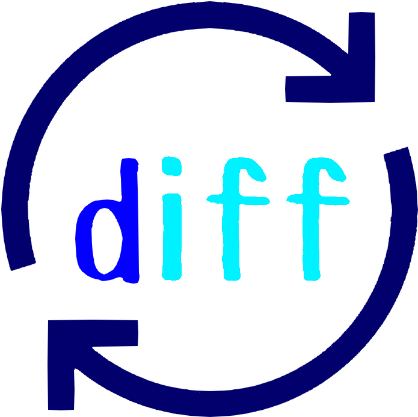

<p align="center">
  <a href="http://nestjs.com/"></a>
</p>

# Diff_Sync_Code

共同編集可能なコードを比較できるアプリです。

## demo

https://user-images.githubusercontent.com/68057090/201527204-3c1b8756-4e50-4baa-b443-3c1213e8a8fa.mp4

## Installation

```bash
$ npm install
```

## Running the app

```bash
# development
$ npm run dev
# production mode
$ npm run build && npm run start
```

# Author

[@yumekiti1204](https://twitter.com/yumekiti1204)

# License

Diff_Sync_Code is [MIT license](https://en.wikipedia.org/wiki/MIT_License).